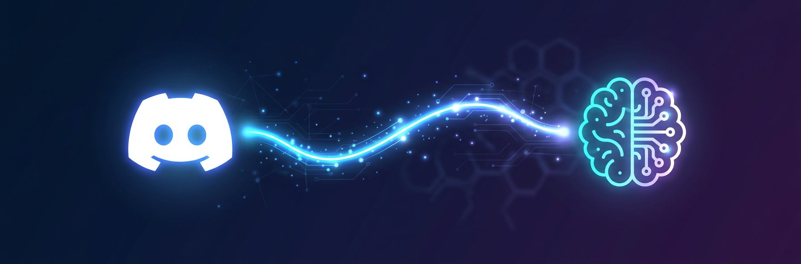

<p align="center">
  
</p>

<h1 align="center">Adaptive Discord Bridge</h1>

<p align="center">
  Your Adaptive agent, on Discord. Same brain, different channel.
</p>

<p align="center">
  <a href="#features">Features</a> &bull;
  <a href="#how-it-works">How It Works</a> &bull;
  <a href="#installation">Installation</a> &bull;
  <a href="#configuration">Configuration</a> &bull;
  <a href="#architecture">Architecture</a>
</p>

---

## What is this?

**Adaptive Discord Bridge (ADB)** connects your [Adaptive](https://adaptive.ai) computer to Discord. Once installed, your Adaptive agent responds to DMs and @mentions in any server — with full access to your computer's memory, tools, apps, and integrations.

It's not a separate bot personality. It's *your* agent, just on Discord.

## Features

**DMs** — Message the bot directly. It has full conversation history, remembers context across sessions, and can do anything your Adaptive agent can do: check your calendar, search your email, build things, run code, send files.

**Server @mentions** — @mention the bot in any channel. It pulls the last 50 messages for context, so it understands the conversation it's joining — not just the message that tagged it.

**Per-channel memory** — Every server channel gets its own persistent memory file. Important decisions, context, and notes are saved automatically and carried across conversations. The agent can also read other channels' memory for cross-channel awareness.

**Multi-user awareness** — In servers, the agent sees who said what. It attributes messages to usernames and tracks active participants.

**File & image support** — Send images to the bot and it can analyze them. The agent can send back images, files, PDFs — anything it can produce on your computer.

**Smart message routing** — Short casual messages in DMs ("hey", "thanks", "lol") get fast lightweight responses without spinning up the full agent. Everything else gets the full treatment.

**Auto-registration** — First @mention in a new server or channel automatically creates the memory structure. No setup needed per-channel.

**Rename handling** — If a server or channel gets renamed in Discord, the memory files update automatically.

## How It Works

```
Discord message → ADB bot process → mcp.promptAgent() → Adaptive agent → response → Discord
```

ADB runs as a utility app on your Adaptive computer. It maintains a persistent WebSocket connection to Discord via discord.js. When a message comes in:

1. **DMs**: Loads conversation history from the local database + global memory context, sends everything to the Adaptive agent via `mcp.promptAgent()`, saves the response.

2. **Server @mentions**: Auto-registers the channel, fetches the last 50 messages from Discord's API, loads the channel's memory file, sends everything to the agent, and replies as a thread.

The agent that responds is your *actual* Adaptive agent — same one you talk to in the Adaptive UI. It has full access to your computer.

## Installation

> **Prerequisite**: You need an [Adaptive](https://adaptive.ai) computer.

The easiest way to install is to tell your Adaptive agent:

> *"Install ADB from https://github.com/GatTheCat-Dev/adaptive-discord-bridge"*

Your agent will follow the [SETUP.md](SETUP.md) guide automatically — clone the repo, scaffold the app, and walk you through creating a Discord bot (~5 minutes).

### Manual installation

If you prefer to set it up yourself:

1. Clone this repo into your Adaptive computer at `/home/computer/discord-bridge`
2. Create a Discord bot at [discord.com/developers](https://discord.com/developers/applications)
   - Enable **Message Content Intent** under Privileged Gateway Intents
   - Generate an invite URL with `bot` scope + Send Messages, Read Message History, Attach Files permissions
3. Add your bot token and config to `.env.development` (see [Configuration](#configuration))
4. Run migrations: `npx prisma migrate deploy`
5. Start the app — the bot connects automatically

## Configuration

Add these to `.env.development`:

| Variable | Required | Description |
|---|---|---|
| `DISCORD_BOT_TOKEN` | **Yes** | Your Discord bot token |
| `DISCORD_OWNER_ID` | No | Your Discord user ID (enables `sendToDiscord` RPC without specifying a user) |
| `ADAPTIVE_HANDLE` | No | Your Adaptive handle (included in agent prompts for personalization) |

All other environment variables (`VITE_BASE_URL`, `PORT`, etc.) are injected by the Adaptive platform automatically.

## Architecture

```
discord-bridge/
├── src/
│   ├── bot/
│   │   └── discord-bot.ts    # Bot core — gateway, message handling, agent bridge
│   ├── api/
│   │   ├── server.ts          # Hono HTTP server + bot startup
│   │   ├── procedures.ts      # RPC endpoints (health, botStatus, sendToDiscord)
│   │   ├── db.ts              # Prisma client
│   │   └── index.ts           # Procedure re-exports
│   └── lib/
│       └── env.ts             # Environment validation (Zod)
├── schema.prisma              # Database schema (conversation history)
├── migrations/                # Prisma migrations
├── SETUP.md                   # Agent-readable installation guide
└── UPDATE.md                  # Agent-readable update guide
```

### Key design decisions

- **Raw gateway events** over discord.js abstractions — more control over message handling and lower overhead.
- **On-demand history fetch** — channel context is pulled from Discord's API on each @mention rather than passively logging all messages. No data stored that shouldn't be.
- **File-based channel memory** — stored at `/home/computer/.memory/adb/` with an `_index.json` mapping Discord IDs to filesystem slugs. Simple, inspectable, agent-editable.
- **Concurrency guards** — one agent call per DM user / server channel at a time. Prevents duplicate responses.
- **Keep-alive self-ping** — prevents the Adaptive platform's idle timeout from killing the bot process.

### RPC endpoints

| Endpoint | Description |
|---|---|
| `health()` | DB status, env, timestamp |
| `botStatus()` | Connection state, uptime, active sessions, bot username |
| `sendToDiscord({ message, userId?, imageUrls? })` | Send a proactive DM to a Discord user |
| `getDiscordHistory({ userId?, limit? })` | Retrieve recent DM conversation history |

## Updating

Tell your Adaptive agent:

> *"Update ADB to the latest version"*

It'll follow [UPDATE.md](UPDATE.md) — pulls latest code, installs deps, runs migrations, preserves your local data.

## License

MIT
